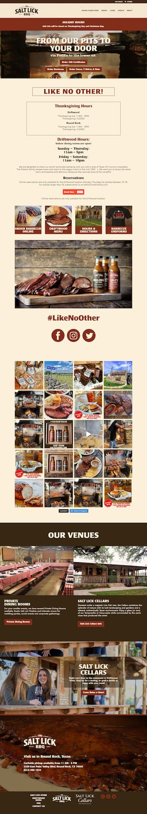
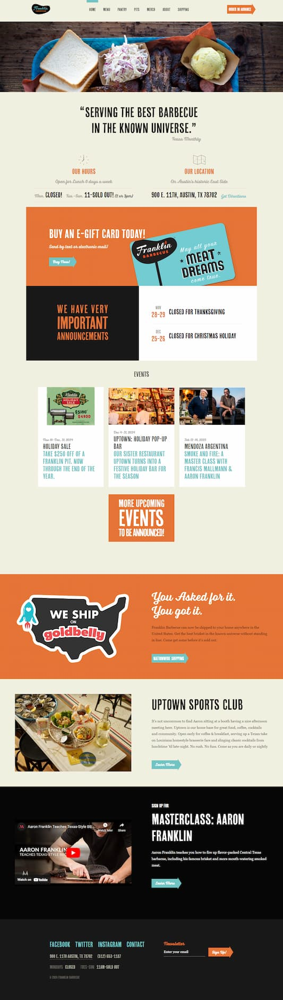

# DGL-103 HTML and CSS Project
## 1. Project Summary
### * Website Chose to Update
[**Big Brisket Barbecue Website:** _https://bigbrisketbarbecue.com/_](https://bigbrisketbarbecue.com/)
### * Reason for New Website
* **Purpose**: to effectively communicate the brand and attract customers.
* **Target Audience**:  
The primary audiences include food lovers and barbecue enthusiasts, while people who live in the vicinity of the Big Brisket Barbecue, tourists and visitors, corporate event planners could also be the target audiences. 
* **Message to Convey and Expected User Actions**:  
The overall message to convey is that the brisket barbecue is the best in town, offering high-quality, mouthwatering barbecue for any occasion.  
Users are expected to take the following actions before they leave the website: placing orders online, visiting the physical address for dine-in or takeout orders, or leaving positive word-of-mouth reviews to improve online reputation.
* **Original Website Analysis**:  
While the original website performs well in performance (93 scores) and accessibility (only a few issues such as missing alternative text) tests, it still needs improvement to address the following issues:
    * **Decreased readability and maintainability**: excessive `
` elements are used, making it harder to understand and maintain the code.  
    **_Improvement_**: Use elements like `<header>`, `<footer>`, `<section>`, `<article>`, and `<aside>` to structure the content semantically.
    * **Inappropriate content organization**: The content of the homepage is too complicated and the structure is not clear, whereas those of other two pages are too simple, which leads to a poor user experience.  
    **_Improvement_**: Reorganize the content to make more meaningful. See [Website Content](#3WebsiteContent) below for details.
## 2. Look and Feel
* **Mood**: Mouthwatering and Inviting
* **Inspiration**:
    * [https://saltlickbbq.com/](https://saltlickbbq.com/)   
    
    * [https://franklinbbq.com/](https://franklinbbq.com/)  
    
* **Colours**:
    * For primary color, a **deep and rich red** can be used for the primary text, buttons, and other prominent elements, which represents the hearty nature of barbecue.
    * For natural colors, a **warm brown** represents reliability and the natural ingredients of BBQ, which could be used for the background and supporting elements, while a **soft off-white** can be used for text, subtle elements and some background as it provides a clean and inviting contrast to the darker colors.
    * For highlight color, a **vibrant orange** can be used for call-to-action buttons, special offers and some important elements.
* **Images**: The logo can be reused from original website with resizing, and some barbecue images can also be reused.
* **Fonts**: _Playfair Display SC_ will be used for headlines, and _Roboto_ for body copy.
## 3. Website Content
### Home Page
_Header_
   * Logo
   * Main Navigation
      * _Home_
      * _Recipes & Service_
      * _Contact_

_Hero Section_
   * **_Heading_**: "Big Brisket Barbecue, Smoked to Perfection"
   * **_Image_**: Inviting, high-quality image showcasing the perfect smoked brisket
   * **_Link to Recipes & Service Page_**: "View All Recipes"

_About Us Section_
   * **_Heading_**: "About Us"
   * **_Sub Sections_**: including two sub-sections as original website, "What we do" and "Who are we?". If possible, replaces the original images with videos.

_Benefits Section_  
   * **_Heading_**: "Our Brisket: Smoked to Perfection"
   * **_List of 3 Reasons Why Big Brisket Barbecue is the Best_**:
       1. Our brisket is crafted using 500 gallon stick burner, ensuring a rich, smoky flavor. 
       2. Slow-cooked to perfection, our brisket is incredibly tender and juicy.
       3. Our grill chefs have extensive grilling experience, ensuring the brisket has a long-lasting taste.

_Call-to-Action Section_
   * **_Heading_**: "Ready to Savor the Flavor?"
   * **_Subheadling_**: "Place Your Order Now and Experience the Best Barbecue in Town"
   * **_Link to Contact Page_**: "Order Now"

_Footer_
   * **_Logo_**
   * **_Navigation_**: Home, Recipes & Service, Contact
   * **_Contact Information_**: Phone Number and Physical Address
   * **_Social Media Links_**: Instagram, X

### Recipes & Service Page
_Header_
   * Same as Home Page

_Recipes Section_
   * **_Heading_**: "Our Mouthwatering Recipes"
   * **_Menu List_**: Placing a menu list on a background image.

_Service Section_
   * **_Heading_**: "Our Excellent Services"
   * **_Sevice List_**: Placing the content of two original pages here.

_Footer_
   * Same as Home Page

### * Contact Page
_Header_
   * Same as Home Page

_Contact Form Section_
   * **_Heading_**: "Contact Us"
   * **_Contact Form_**: Name, Email*, Message, Attach File, Submit Button

_Contact Information Section_
   * **_Heading_**: "Special Requests?"
   * **_Paragraph_**: The original paragraph on Home Page.
   * **_Contact Information_**: Title, Opening Hours, Phone, Physical Address, Map

_Footer_
   * Same as Home Page
